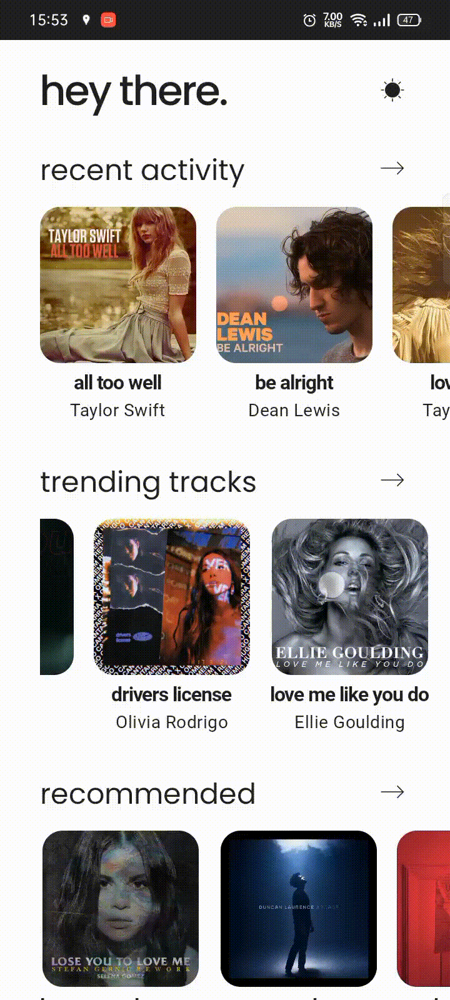

<h1 align="center">Music App</h1>

A simple music app

This app is focused on learning about Themes in Jetpack Compose.
The UI is inspired by [Nedia Patrik](https://dribbble.com/shots/16457856-Music-App-UI-Home)\'s shot on Dribbble.

## Screenshots

## Built With

- Android Studio
- Kotlin
- Jetpack Compose

## Author

**Hardik Sachan**

- [Github](https://github.com/hardiksachan)
- [LinkedIn](https://www.linkedin.com/in/hardik-sachan/)
- [Twitter](https://twitter.com/simplyHardikk)

## 🤝 Support

Give a ⭐️ if you like this project!